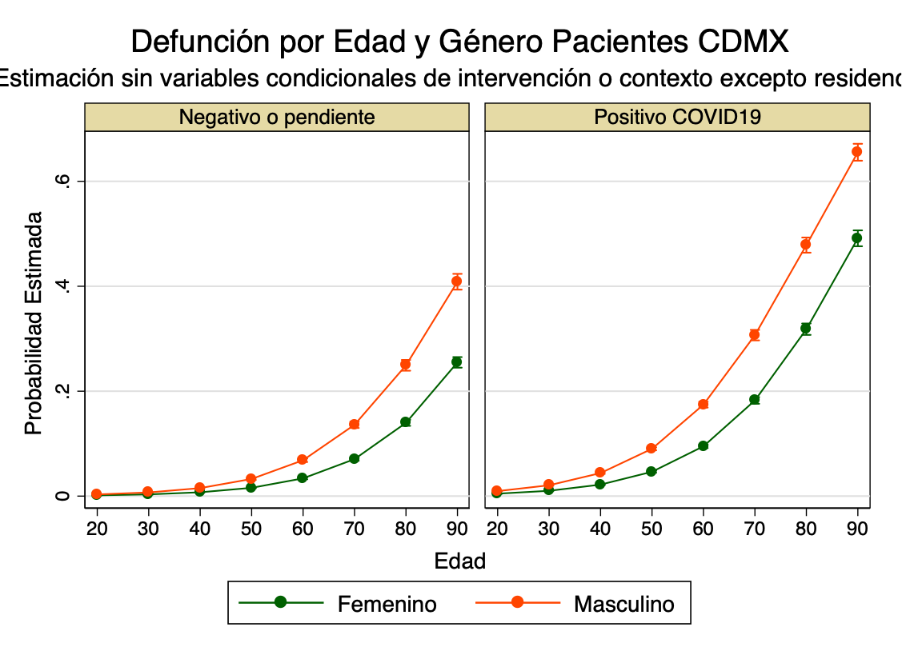

To compile this file, install the following packages first:

```{r install_packages, eval=FALSE }
# Note: this R code is not executed by R, i.e. eval=FALSE #

# Install packages first:
install.packages("devtools")
install.packages("knitr")

# Install Stata Markdown via devtools
library(devtools)
devtools::install_github("hemken/Statamarkdown")
```

```{r libraries, echo=FALSE, message=FALSE}
# Add required libraries
library(Statamarkdown)
library(knitr)
library(tidyverse)
library(foreign)

# To fit R code when the file is knitted:
opts_chunk$set(tidy.opts=list(width.cutoff=60),tidy=TRUE)
```


## COVID19 Data Transparency

A truly remarkable aspect of the Mexican Government response to the COVID19 pandemic is that public officials have adopted a policy of transparency and data release that although not unprecedented, is quite noteworthy when considering the temptation to do otherwise. The Mexican public response has not been very successful in its containment of the pandemic, and the country remains with one of the highest death tolls in the world, both in sheer numbers and per inhabitant; it has sustained for the longest time some of the highest Case Fatality Ratios (CFR, defined as the deaths divided by the number of identified positive cases) and positivity rates in the world (positive results of tests divided by the number of tests performed), and official studies by the health officials have revealed a very high number of excess fatalities.

https://www.gob.mx/salud/documentos/datos-abiertos-152127

https://datos.gob.mx/busca/dataset/informacion-referente-a-casos-covid-19-en-mexico

Historical repository (daily):

https://www.gob.mx/cms/uploads/attachment/file/590729/Datos_abiertos_hist_ricos_2020.pdf

And it is always worth getting some perspective of the COVID19 pandemic around the world, and how Mexico is doing comparatively, at these two sites:

Our World in Data https://ourworldindata.org/coronavirus/country/mexico?country=~MEX

IHME https://covid19.healthdata.org/mexico?view=total-deaths&tab=trend

Imperial College London https://mrc-ide.github.io/global-lmic-reports/MEX/

## Visualization tools

CONACYT. Tablero General. https://datos.covid-19.conacyt.mx/ This includes the epidemiological scorecard, a dashboard of tests, results and deaths updated daily, municipal level maps of those basic indicators, and easy download functionality for daily municipal and state aggregations.

ENI/COVID-19. https://coronavirus.conacyt.mx/ Comprehensive scientific data depository of CONACYT is not the dashboard, but this site that includes visualization tools for the main studies sponsored by the Mexico Science Council. The dasboard includes several scientific projects related to the construction of statistical models for vulnerability, reproductive number and movility indexes and epidemiological curves calculated through various modeling strategies (Gompertz and the so called AMA model, a Bayesian SIER model, for the Metropolitan Areas).  

Vulnerabilidad ante COVID-19. http://sigcovid.geoint.mx/public Dashboard provides a vulnerability estimates at the municipal level, incorporating the underlying socioeconomic characteristics as measured by Census indicators, mortality by cause indicators, and health infrastructure and services availability. 

Indice de Movilidad. https://coronavirus.conacyt.mx/visualizaciones/estatales/ Mobility data gathered from social media in Facbook, Google and Twitter, tracking social distancing across states.

Tiempo de Atencion Hospitalaria. https://coronavirus.conacyt.mx/productos/atencion_hospitalaria/tiempo-atencion-hospitalaria-02.pptx This dashboard is not available as an interactive tool, but it provides in ppt presentations visualizations of the evolution of the response times in hospital and clinics. 

iCOVID19. UNAM visualizer from the Geography Institute https://gits.igg.unam.mx/iCOVID-19/home provides daily updated information on disease spread at the municipal level, morbidity, mortality by disease, health infrastructure, vulnerability indexes for municipalities and metropolitan areas, as well as easy access to all the indicators used as sources. All data can be readily downloaded in geographic form as .shp format.

Tablero Interactivo  Dashboard from the Instituto Nacional de Salud Publica Intellingence Unit (Lina Sofia Palacio Mejia and Juan Eugenio Hernandez Avila) which has the virtue of providing a Tasa de Ataque, which uses population as the denominator for positive detected cases, hence being less prone to be an artifact of various testing strategies. The dashboard is built in Tableau with necessary functionality for data download. 

The Geography Institute at UNAM also maintains the Sistema de Informaciónn de la Red IRAG, the dashboard used from the Health Secretariat to know the hospital occupation at the state, municipal, health jurisdiction and hospital level https://gits.igg.unam.mx/red-irag-dashboard/reviewHome

Transparencia COVID19. https://datos.cdmx.gob.mx/pages/covid19/ A remarkable exercise in transparency spearheaded by the Agencia Digital de Innovacion Publica ADIP in Mexico City, offering hopital dashboards and data at the neighborhood (colonia) level.

Datavizero. https://datavizero.com/mapas-covid19 Baruch Sangines has been at the forefront of visualization tools and integration of GIS and data including neighborhoods in Mexico City.  

Coronamex. https://coronamex.github.io/ Sur Herrera Paredes (Stanford Biology) real time visualizations that allow for a true depiction of the evolution of the pandemic not only nationally, but across states, metropolitan areas and different types of municipalities. I wish I had come across this excellent site earlier. Everything, everything (including R code) is available to reproduce and further analyze in the github repository.

Medidas economicas COVID-19. https://lnppmicrositio.shinyapps.io/PoliticasEconomicasCovid19/ Tracking the policy responses of the Mexican states by program and type of support. From the Laboratorio de Politicas Publicas CIDE led by Sebastian Garrido.

Taller de Datos Nexos. https://datos.nexos.com.mx/ Various articles with replication datasets including wrok on neworks, the first analyses of excess mortality, and testing. 

Segasi | COVID-19 | Mexico. http://segasi.com.mx/covid19/mexico_nal.html#resumen Sebastian Garrido repository. Until the end of August, updated visualizations and datasets of the evolution of the pandemic through time. Particularly important to understand the registration practices of Mexican health authorities.

Exceso de Mortalidad en Mexico. https://coronavirus.gob.mx/exceso-de-mortalidad-en-mexico/ Health Ministry dashboard created by an interinstitutional group estimating excess mortality from death certificates (administrative records) in comparison to medical records. Full dataset (municipal level) can be downloaded for further analysis.

Vulnerability Index Avila-Ortega, Flores-Santana, Gomez-Hernandez http://terradigitalis.igg.unam.mx/html/mapas/numero8/avila/mapa_interactivo/ This index of vulnerability makes use of ENSANUT data to asess the comorbidity risk in the underlying population as well as the spread of health clinics as indicated by CLUES. 

The Mexican strategy was premised on a combination of epidemiological surveillance and a swift public campaign of social distancing (Susana Distancia) that became the staple of public service announcements. 

The epidemiological scorecard (semaforo) indicates with colors (green, yellow, orange and red) the stringency of containment measures. Red implies a lockdown, although it allows residents to walk around their homes and essential workers to perform their activities. Orange allows non-essential economic activity to be carried out at 30 percent of the personnel and reduced circulation of people in public spaces. Yellow allows for opening of public spaces, and gatherings of reduced numbers even in closed spaces. Green allows all normal activities (The states under this condition, Chiapas and Campeche, are likely to be practicing different testing than the rest, rather than being safer than the rest of the country). The scorecard makes no mention of face coverings or masks, even though the technical document does mention that regardless of the epidemiological risk, "face coverings should be used correctly" (p.23). https://coronavirus.gob.mx/wp-content/uploads/2020/10/SemaforoCOVID_Metodo.pdf

https://coronavirus.gob.mx/semaforo/ 

In fact, the "General Guidelines for Closed Public Spaces During COVID-19 issued by the Health Secretariat on March 27, 2020 at the beginning of the pandemic has not been updated to reflect the use of face covering. https://www.gob.mx/salud/documentos/lineamiento-general-espacios-publicos-cerrados-en-covid-19


## Case Fatality Ratio

This is an R Markdown document. Markdown is a simple formatting syntax for authoring HTML, PDF, and MS Word documents. For more details on using R Markdown see <http://rmarkdown.rstudio.com>.

When you click the **Knit** button a document will be generated that includes both content as well as the output of any embedded R code chunks within the document. You can embed an R code chunk like this:

```{stata cfr, echo=FALSE}
clear
version 14

********************************************
** CFR of COVID in Mexico City            **
********************************************

graph use "/Users/albertodiaz/Box/COVID19/Databases Mexico/DemographyCDMX32.gph"
graph export "DemographyCDMX32.png", as(png) replace
  
```


## Something else