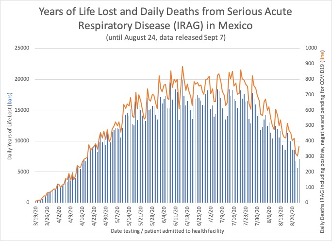
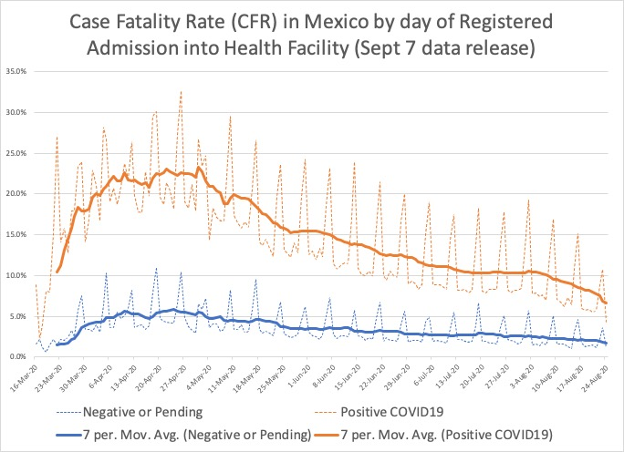
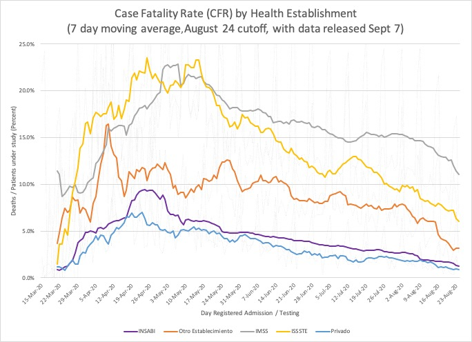
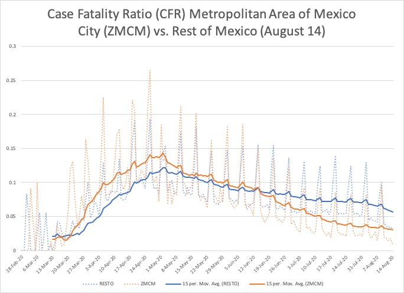
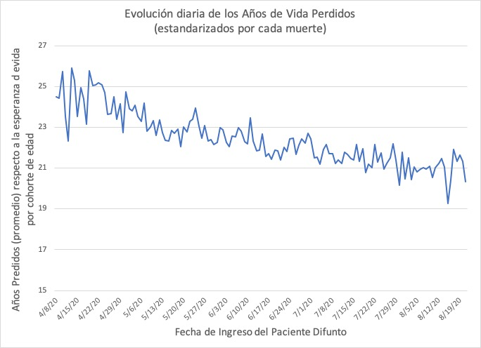
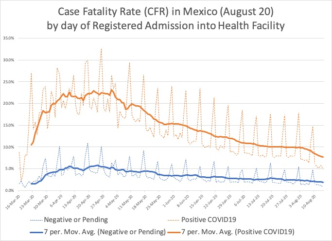
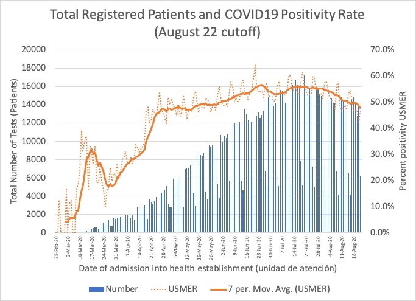

# September 7 update

I do not have a lot of time to update the repository, since classes are now starting. The good news is that the inflection point of August seems to be a solid trend in the current data. I have not updated all the graphs, but the .do file with syntax (in STATA) for the current data is available. I have also included a short .do file to create the temporal files, which are all put together for Excel graphs in the attached file CFRdaily9.0.xls

In terms of some new visualizations, those interested in the Mexico City trends might want to see the graph showing how the share of deaths has now stabilized, as the epidemic decelerates (even though deaths and cases keep on growing), but CDMX has a more assertive testing policy than the rest of the country, so now the City has around 10 percent of the deaths, but 20 percent of the known tests / cases. 

Notice I have also changed the way I label the graphs slightly, noting that we do not quite know when we speak of a test or a patient under study. This is important for patients that may be tested more than once, or might be registered in different ways at different times as their diseaase and treatment changes. It is the most plausible explanation for the observed patterns of patients disappearing sometimes when the daily update of the the dataset is done by the Mexican government.

I have shortened the Positivity graph to start in April so it is more obvious how stubbornly high the rate has remained.

The years of life lost continues being a good metric of the cost of the epidemic, although the good news is that younger patients are surviving more often now.

And although the CFR trends seem to be positive, do keep in mind that even for a regular influenza these are very high death rates, suggesting false negatives, and that there are very large differences across health establishment (although the usual caveat I have made before keeps on being important, in that IMSS probably gets the most seriously ill cases)

Stay safe by using facial covering, practice social distancing if you can, and limiting the network of your contacts. This is not over, we will have cases and deaths for some time still.

# August 28 update

The good news is that I am more confident today that Mexico is at an inflection point in terms of the evolution of the epidemic. This has been difficult to infer in previous week due to the delay in reporting of cases and tests. But with the data released on August 28, there seems to be a firm trend in August that shows improvements in the CFR and the positivity rate, even though less testing is being performed. Whether this respite will continue is still to be seen, and depends probably on the way the pandemic evolves in territories where it has thus far been less present. A lot of the improvements are attributable to changes in the metropolitan area of Mexico City, where the CFR has been radically reduced. I now include a graph of that temporal trend. And there is a .do file with collapses into time series (even though I have not automated the production of graphs, which I keep on doing in Excel, forgive me for the primitive method). 

The other new visualization that I am sharing is the evolution of the Years of Life Lost calculated for both positive and negative and pending COVID19 cases, which provides a sense of the magnitude of premature loss to the country.

Among the new papers that have come out, it is particularly relevant to think about the way in which the CFR might be used to assess undereporting. This paper by Russell et al. attempts an adjustment that uses the delay in hospitalization to produce a more accurate CFR. But the greatest adjustment to estimate underreporting comes from using a "true" 1.4% CFR to measure the degree of underreporting. With the exception of Peru, Mexico is the country in the world with the greatest underreporting. The paper estimates that only 12 percent of the true cases are being recorded in Mexico. 

https://cmmid.github.io/topics/covid19/global_cfr_estimates.html

This can be thought of as a simple calculation generated by an implicit CFR for Mexico in that study of 11.7 percent. Even if we use a lower CFR that is found towards the beginning of August of around 8 percent, this would mean that more than 80 percent of the cases in Mexico are not being 

Elsewhere, I have shown the trends in the CFR and the Positivity trend. https://medium.com/@adiazcayeros/state-capacity-and-mexicos-covid-19-response-3696295312f1

With the upadated data one can see that testing has slowed down slightly over the past weeks, and that the positivity rate in Mexico remains one of the highst in the world, still above 50 percent.

# Case Mortality of COVID-19 patients in Mexico 

Since April 14 I have been keeping track of the official data released by the Federal Government of Mexico of
the information regarding COVID-19 tests for patients seeking care in the national health system, including
both public and private hospitals and clinics. The database has been growing very quickly, as the 
testing capacity of the Mexican government has been ramped up. The database is updated regularly in the 
Datos Abiertos platform of the Federal Government, where it is likely to be kept permanently. There is
a repository of every daily dataset in the Secretaria de Salud at the following link: https://www.gob.mx/salud/documentos/datos-abiertos-bases-historicas-direccion-general-de-epidemiologia

As of August 20 the dataset includes 1,226,113 patients / tests / cases that form the basis of study for the federal 
strategy. It is important to note that this data has been duly released by the federal government 
and updated every day, and there is no reason to believe it is any different from the data they have been
using to build and assess their epidemiological models. It does not include infected individuals who do not seek care, and given the relative paucity of testing in Mexico, it is likely to have very few asymptomatic cases.

The severity of COVID19 in Mexico can be measured, albeit imperfectly, through what is known as the Case Fatality Ratio (CFR). This is not a proper mortality rate from the disease, because it has a very imperfect denominator. The CDC defines Symptomatic CFR as follows:

	Symptomatic Case Fatality Ratio: The number of symptomatic individuals who die of the disease among all 
	individuals experiencing symptoms from the infection. This parameter is not necessarily equivalent to 
	the number of reported deaths per reported cases, because many cases and deaths are never confirmed to 
	be COVID-19, and there is a lag in time between when people are infected and when they die. This parameter 
	reflects the existing standard of care and may be affected by the introduction of new therapeutics.
(https://www.cdc.gov/coronavirus/2019-ncov/hcp/planning-scenarios.html).

In this repository I have been releasing STATA code and graphs that allow a visualization of a simple statistical model (logit) of the public information on COVID19 testing in Mexico. The focus in terms of the dependent variable is the Case Fatality Ratio, which can be readily estimated under the assumption that each case is independent and identically distributed. A large number of patients with confirmed positive results to COVID-19 (59,106) had died by August 20. In addition, 16,566 patients had died having tested negative (or pending) to COVID19. This yields a CFR of 10.86 percent for the positive cases and 2.43 for the negative ones. The overall CFR for the whole dataset is 6.17. In comparing CFRs it is critical to understand that the level of testing in Mexico has been lower than in most other countries. 

Although the specificity of the tests available is very high, there are reasons to believe that the sensitivity (the possibility of false negatives) is relatively low, given the procedures for specimen collection. Hence it is important to analyze all the information of deaths, since even those that are pending or negative exhibit a larger CFR than a typical influenza like illness. The level of positivity in the full dataset is 44.4 percent (a level that has remained high over the past several weeks, notwithstanding increasing testing), suggesting that a large number of asymptomatic patients may be present in the general population.

I will try to update the graphs and analysis, as I have done in the past, although most likely now on a monthly basis.

# Data source and patients included under study

The dataset of patients who have been tested for COVID19 in Mexico is generated through two different processes. The first one is a systematic sample, collected through the 475 so called USMER clinics (Unidades de Salud Monitoras de Enfermedades Respiratorias) for ambulantory patients with mild symptoms, within the epidemiological surveillance system (SISVEFLU, now called SISVER, established after the 2009 H1N1 pandemic). The system collects a test for every tenth patient, regardless of the seriousness of their symptoms. The patient does need to be been seeking care for a light respiratory infection, with signs of cough, fever or headache. In the serious acute respiratory infections, accompanied by difficulty breathing (Infección Respiratoria Aguda Grave, IRAG), the system establishes that all patients in USMER clinics must be tested (https://www.gob.mx/cms/uploads/attachment/file/552972/Lineamiento_VE_y_Lab_Enf_Viral_20.05.20.pdf). A third of the data (36.44 percent) comes from these USMER hospitals and clinics. For the rest of medical establishments in the country, a patient is tested if they fulfill the definition of a suspicious viral respiratory disease case, according to a simple algorithm. 

In all cases health providers fill out a format called "Formato de Estudio de Caso Sospechoso de Enfermedad Respiratoria Viral", which includes the information that the government has released publicly (https://www.gob.mx/cms/uploads/attachment/file/552971/Estudio_epidemiologico_de_caso_sospechoso_de_enfermedad_respiratoria_viral_20.05.20.pdf). The public database includes most of the information in this format, with the exception of the personal identifiers, the classification of symptoms, and some treatment data, especially regarding use of antivirals. For some reason that is not clear, given that it does not involve any human subjects risk, the database is missing three sociodemographic characteristics asked in the format: 1) the self ascription as a member of an indigenous community (although the database does include the information on linguistic identification); occupation (which is an open question, so may be an issue of coding too many different answers) and whether the patient is an educator (¿pertenece a alguna institución educativa?).

The format includes some additional information on the evolution and release of the patient, but this information is not released publicly in its entirety. The reasons for such withholding of information are not clear, since they do infringe on privacy or human subjects protections. Somee of the data on the evolution of the patient is publicly available however: whether a patient was moved to an Intensive Care Unit (ICU), cases of intubation, or the diagnosed of the patient as a case of pneumonia. The cases that resulted in deaths were also publicly released. A dictionary of all the released variables is available here: https://www.gob.mx/salud/documentos/datos-abiertos-152127

Some researchers have expressed concerns as to whether there have been changes over the course of time in the inclusion or exclusion of patients, and whether some of them may have been duplicated, particularly if they had more than one test performed. It is relatively easy to check for potencial repeated patients by matching them on their date of admission, onset of symtoms and sociodemographic and clinical characteristics (with the same age, gender, co-morbidities, treatment, and living in the same municipality). There are only around three thousand cases that may be repeated patients having identical characteristics. It is much more difficult to know whether there have been inconsistencies over time in the registration of patients, although what we do know is that there are significant delays, that vary across health institutions and states, in the timeliness of the reporting of cases. Often deaths that may have occurred many days earlier show up in the dataset with a significant lag. The most systematic analysis of this issue as far as I am aware has been done by Jorge Andrés Castañeda and Sebastian Garrido (https://datos.nexos.com.mx/?p=1351).

Perhaps the most important shortcoming of the public database is that it does not include information on the release date, and whether the release (alta) was due to improvement (mejoría), cure (curación), voluntary release, or transfer. Given that the data exists, and some of it is already public, a potential reason to not allow researchers to know about the release of patients could be related to fears about what it may reveal too much regarding the quality of care. This might be the same reason why the data on signs and symptoms and treatment is not publicly available. Some researchers are concerned about whether there have been changes over the course of time in the inclusion or exclusion of patients, and whether some of them may be duplicated, particularly if they had more than one test performed. It is relatively easy to check for potencial repeated patients by matching them on their date of admission, onset of symptoms and sociodemographic and clinical characteristics (with the same age, gender, co-morbidities, treatment, and living in the same municipality). There are only around three thousand cases that may be repeated patients having identical characteristics.

# Analysis of Case Fatality Rates in Mexico

The statistical models I have estimated should not be used for any causal inference. They do not support, nor do I wish to make any claims about the reasons why death rates are higher in some places than in others, or that some variables are associated (either positively or negatively) with the probability of death. They should be thought of as relatively sophisticated cross tabs, or descriptive statistical tables, that seek to highlight a complex and interrelated set of processes by conditioning the table on various individual or aggregate level characteristics. 

The graphs provide the estimated CFR for both positive and negative (or pending) test patients, according to 
various correlates also included in the dataset. It is very important to reiterate that finding a correlation
in this type of data is no evidence of a causal relationship. This should be particularly clear when 
considering that intubation, hospital care in an ICU or having an initial diagnosis of pneumonia are all 
positively correlated with death. That cannot be interpreted as meaning that urgent care interventions
increase the likelihood of dying: the relationship reveals, instead, the very strong selection effects that prevail
throughout all this data. A patient only enters the sample if she is seeking care, and more seriously ill
patients are more likely to require extraordinary measures, but they may still die, notwithstanding the care
they receive, and hence those correlations with intubation or ICU treatment.

I am not particularly interested or competent to analyze the medical aspects of the comorbidity factors. However, 
including them in a statistical model is important because they are a large part of what accounts for an
eventual fatality. What interests me are the differences in institutional performance as exhibited by state
level fixed effects and the institutional makeup of health institutions in Mexico. This is not the place to explain the complexity of the Mexican health system, but in an extreme simplification one can think of three pillars, one based on the Instituto Mexicano del Seguro Social (IMSS), where social security benefits are provided, including health, to workers and their families on the basis of the contributions they and the firms that employ them make to the national health system. Federal public sector employees, and many employees from the public sector at other levels of government have equivalent coverage through ISSSTE. IMSS also administers a very important system of clinics in rural areas, that are now labeled as part of the Bienestar system, which attend rural patients regardless of coverage (derechohabiencia). The other public health system is provided through what used to be the SSA clinics, now labeled as INSABI (https://www.gob.mx/insabi), variously administered by the federal or the state level of government. For Mexican rich patients there is also a system of private health establishments, which provides care usually on the basis of private health insurance. Beyond these three pillars, there are also various health establishments that may be run by the Red Cross, state or municipal governments and some Universities. For an account of the Mexican health system that focuses mostly on the reforms before the current administration see the book by Laura Flamand and Carlos Moreno Jaimes (https://books.google.com/books?id=UxCaBgAAQBAJ&lpg=PT7&ots=lCLObhfHUy&dq=laura%20flamand%20y%20moreno%20libro&pg=PA1#v=onepage&q&f=false)

Although more sophisticated modeling choices are possible, the simple logits allow for a clear visualization of 
the main patterns and some indication of strong differential institutional performance. In contrast to an OLS model, the logit takes into account that the distribution of the dependent variable is dichotomous, taking only the value of 1 when there is a death and 0 otherwise. Since deaths are (fortunately) not so frequent, even among patients contracting COVID19, an OLS model does not fit well the characteristics of the distribution. However logit models provide coefficients in the form of log odds ratios, which are difficult to interpret. In order to help with interpretation, the graphs provide the estimates that are provided by the model as probabilities of death under various scenarios given by the independent variables. All the code needed to run the estimates and visualize the graphs (in STATA) is provided in this repository.

The simplest estimation one can make only uses two sociodemographic variables, namely age and gender, as determinants of the CFR. The simulation of those coefficients is presented in the first graph, which presents the predicted value of the probability of death depending on whether the COVID19 test result was negative (or pending) or positive. In the update of the dataset from August 20 there were 59,106 deaths of positive cases, but there were an additional 16,566 deaths of patients seeking care for serious acute respiratory infections (Infección Respiratoria Aguda Grave, IRAG) which are part of the dataset. It is important to include those negative (or pending cases) given that they are potentially false negatives or deaths that occured too soon (often on the day of admission) to register test results. 

In a more complete model the co-morbidity factors play an important role as a risk factor or a conditioning variable that may increase the likelihood of death. The models that include those individual level correlates are simulated in the next set of graphs. Those co-morbidities are by now rather well know, not just from the case of Mexico but since the first analysis of data coming from China and Italy were done. It is clear that renal chronic conditions, immunosupressed and diabetes might play an important role in how the disease affects different patients. Smoking does not show up in the Mexican data as a significant factor afecting the risk of the death. Ths risk is not any different for pregnant women (unreported in the graphs). 

I also present a set of models that include institutional variables related to the state where the patient has reported his or her residence, and the type of health establishment where the patient receives treatment. Consult the full tables in the .tex files included in the repository. 

Many health interventions save lives. It is important to note that while the inclusion of hospitalization (instead of ambulatory care), being admitted in the ICU or intubation and having a clinical diagnosis of pneumonia all are associated with a larger CFR, this does not mean that there is a causal relationship. More likely these are selection effects. Intubation and ICU care are not very common in the dataset. Hence the extreme example of a seriously ill patient may not be estimated with as much precision as the other correlates. 

Institutional differences among the various health establishments in Mexico are rather strong, particularly for IMSS and Private hospitals. These may be completely driven by selection effects, given that the characteristics of patients being admitted into each type of health establishment may be quite different: richer, healtheir and less serious cases may be arriving to private hospitals, while much more seriously ill, including uninsured patients may be treated in IMSS hospitals and clinics. But it is possible that some of the differences among institutions are driven by the quality of care and the resources available in each type of institution. There seem to be also some differences in the quality of care among ISSSTE and other hospitals depending on whether the patient has tested positive to COVID19, and the degree of seriousness of the case. These institutional differences are presented here using only the USMER part of the dataset.

The estimation also includes variables (for which I do not provide graphical visualizations) that may relate to learning to treat the disease and how seriously ill patients arrive to seek care. There is a small trend in which patients admitted at later dates are less likely to die, although this could be an effect of the way in which testing has increased the size of the denominator; and there is no evidence suggesting that patients with longer periods since the onset of their symptoms are more likely to die.   

The models can also include a fixed effect by state. The graphs presented above are different from a typical comparison of CFR by state because they take into account scenarios for a type of patient that remain fixed across states, and hence are not driving the differences being observed. That is, if a state had a different type of patient with more serious conditions this would influence the way in which it compares with another state registering less seriously ill patients. Concentrating attention on the idiosyncratic differences found in each state focuses attention on the way the disease is spreading over the territory, as well as potential differential performance by each state.

Finally, in this update I am able to provide, given that a third of the dataset comes from the metropolitan area of Mexico City, municipal level fixed effects for the Alcaldias and Municipalities in the metropolitan area of Mexico City. Those estimates only include patients admitted into the hospitals and clinics in Estado de Mexico and CDMX, and providing municipal fixed effects according to their place of residence. The most noteworthy shift in this estimates comparted to previous analyses is that there is now very little difference in the CFR among Alcaldias or Municipalities. This suggests that the care in the Metropolitan Area of Mexico City, including the Ciudad de Mexico government and the municipalities in the Estado de Mexico, have been able to establish a relatively similar standard of care. This is not the case across states, that still show very important differentials in their CFR, that are not accounted by factors related to health establishments, comorbidity or the seriousness of the cases.

# August 20 update

I wish I could show in this update graphs that change the general trend of CFR in Mexico with the release of data a month later (August 20) but I have to say that there are still the same patterns and trends. If anything, the last couple of weeks show a slowdown in testing, that given the positivity rate is likely to be a decision within the health system, that is not enhancing its capacity to track cases, and sees little clinical use of the tests. After all, the patients who are seriously ill (hospitalized, intubated men diagnosed with pneumonia treated in the ICU) are dying at similarly high levels even when they do not test positive.

# July 21 update

This is the 19th update I make to the analysis of COVID-19 CFR in Mexico using the official dataset released by the Health Ministry (now with data from July 19, 2020). The analysis differs slightly from the first versions in that I highlight the USMER data as being generated by a process that ensures more cases of potentially less seriously ill patients being tested (although with a respiratory ailment that takes them to seek care in the health system). The comorbidity analysis is done by institution, with log odds ratios rather than simulations presented for the visualization. This allows an easier comparison with respect to results that are already emerging in the literature analyzing this data.

It is not easy to keep up with the many papers released, but see specifically the following:

https://823875a3-4368-4de0-97fc-bc7207d66703.filesusr.com/ugd/dc1c3f_aaa7dc8fc5ff47d8b678593e36cc69d5.pdf

https://www.medrxiv.org/content/10.1101/2020.05.24.20104414v1

https://www.medrxiv.org/content/10.1101/2020.04.21.20074591v1

The the Mexican database is that it exhibits a very severe disease as compared, for example to US planning scenario parameters considered by the CDC. The arrival of patients seeking care is not too different from that of the US: 43.3 percent of the patients seek care after less than two days with symptoms, 46.5 percent within 3 to 7 days, and only 10.2 percent come to seek care after 8 days of symptoms. However, the time to hospitalization is very short: the average patient in Mexico, regardless of age, is hospitalized in 3.6 days from the onset of disease (standard deviation 3.5 days), while this figure is about seven days. We do not know in the Mexican public data how many days patients are hospitalized, nor how many days it takes for them to be transferred to an ICU, although this information must be part of the modeling exercises being performed by Mexican scientists to estimate hospital bed and ICU demand. In the US more than 20 percent of hospitalized patients are transferred to ICU, and most of them (around 70 percent) receive mechanical ventilation. In Mexico only 8.8 percent of hospitalized patients enter the ICU (regardless of whether they tested positive to COVID19 or not). The time from onset to death is about 15 days in the US, while in Mexico it is 9.8. It is important to note that this comparisons may reflect important differences in the populations of both countries, but they are also likely to reflect some differences related to the quality of care.

# Notes on sources and updates

Files labeled with no.22 have the updated information from August 20 with 1,226,113 patients

Files labeled with no.19 have the updated information from July 19 with 814,649 patients

Files labeled with no.14 have the updated information from June 11 with 381,129 patients

Files labeled with no.11 have the updated information from May 23 with 215,656 patients

This is the original text I put on my first analysis back in April... in Spanish

En un importante ejercicio de transparencia, esencial en la actual crisis, las autoridades 
sanitarias del Gobierno Federal en México liberaron el 14 de abril una base de datos llamada 
“Información referente a casos COVID-19 en México”. (1) Esta información es presumiblemente la 
base de datos más completa de las pruebas de COVID19 realizadas hasta ese momento, misma 
que utiliza el gobierno para entender el proceso epidemiológico que nos aqueja. En ese 
momento la información actualizada tenía, según las autoridades, 5,014 casos identificados 
como positivos, 332 defunciones atribuibles a esta enfermedad, y las “más de 37 mil personas 
que hasta el momento han sido ya estudiadas y entradas a un protocolo de investigación de 
todos estos casos en relación a COVID-19 en México”. (2) 

Los investigadores rápidamente aprovecharon la nueva información para ofrecer 
visualizaciones de diversos tipos, mostrando los patrones de dispersión territorial. Se puede 
estudiar uno de los principales retos que se enfrentará durante las próximas semanas por 
motivo de la fragmentación del sistema de salud. Posiblemente la reticencia más grande de las 
autoridades de salud pública para liberar esta información de los casos individuales de pruebas 
de COVID19 que se han realizado tiene que ver con la posibilidad de una interpretación o uso 
poco cuidadoso de la información por analistas que no son expertos en epidemiología.

Es importante aclarar que el ejercicio estadístico no permite conocer la causalidad de los 
procesos de salud pública involucrados en esta epidemia, pues como se repite con frecuencia, 
una correlación no es evidencia de causación. El ejemplo más claro es pensar en el coeficiente 
estadístico que se obtiene en una estimación que incluya la mortalidad como variable 
dependiente y el uso de entubamiento o el ingreso a las unidades de terapia intensiva: esas 
variables si se colocan como variables independientes se correlacionan con la muerte en forma 
positiva, pero claramente no son una CAUSA que aumente la probabilidad de una defunción. 
La razón por la que aparecen correlacionadas con la muerte es porque reflejan una variable 
omitida en el modelo, a saber, la gravedad del padecimiento de la paciente, que si se encuentra 
muy enferma, requiere de intervenciones más radicales. Dado que los pacientes más graves 
tienen una mayor probabilidad de morir, el entubamiento o la unidad de terapia intensiva 
capturan estadísticamente esa relación, pero no son en sí mismas causas de muerte. Si se 
realizara un experimento controlado, con un grupo de control, y uno de tratamiento asignado 
aleatoriamente, que recibiera la intervención médica, se demostraría contundentemente que la 
intervención médica salva vidas y se podría estimar la magnitud del efecto. Por lo tanto aunque 
la relación entre intubación o terapia intensiva debería ser negativa en un modelo causalmente 
identificado, este es exactamente el signo contrario que el que arroja una estimación simplista 
de carácter más bien inductivo. 

No existe una manera contundente pare resolver el problema de variables omitidas. Pero se 
pueden realizar algunos procesos estadísticos, siempre sujetos a error, que permitan atenuar 
este problema mejorando el diseño de un estudio estadístico, buscando restringir la 
comparación entre casos dentro de la base de datos. Por ejemplo, se podrían utilizar sólo los 
datos de pacientes especialmente enfermos, o se puede realizar un ejercicio de matching, que 
se puede traducir como un apareamiento, en que se busca comparar sólo casos de 
entubamiento que sean una especie de experimento natural, a saber, casos que podrían haber 
sido entubados en un escenario contra-factual, pero que no fueron entubados, por razones 
exógenas al padecimiento. 

(1) La base está disponible en la siguiente liga (consultada el 17 de abril): 
https://datos.gob.mx/busca/dataset/informacion-referente-a-casos-covid-19-en-mexico
Las características y fuente de la información según el portal de datos abiertos:
Información del Sistema de Vigilancia Epidemiológica de Enfermedades Respiratoria Viral, que informan 
las 475 unidades monitoras de enfermedad respiratoria viral (USMER) en todo el país de todo el sector 
salud (IMSS, ISSSTE, SEDENA, SEMAR, ETC).
Nota: Datos preliminares sujetos a validación por la Secretaría de Salud a través de la Dirección General 
de Epidemiología. La información contenida corresponde únicamente a los datos que se obtienen del 
estudio epidemiológico de caso sospechoso de enfermedad respiratoria viral al momento que se 
identifica en las unidades médicas del Sector Salud.
De acuerdo al diagnóstico clínico de ingreso, se considera como un paciente ambulatorio u hospitalizado. 
La base no incluye la evolución durante su estancia en las unidades médicas, a excepción de las 
actualizaciones a su egreso por parte de las unidades de vigilancia epidemiológica hospitalaria o de 
jurisdicciones sanitarias en el caso de defunciones.

(2) José Luis Alomía Zegarra, Director General de Epidemiología, versión esteneográfica de la conferencia de prensa 
del 13 de abril (https://www.gob.mx/presidencia/es/articulos/version-estenografica-conferencia-de-prensa-
informe-diario-sobre-coronavirus-covid-19-en-mexico-240239?idiom=es).

Latest commit
523a0c7
3 minutes ago
